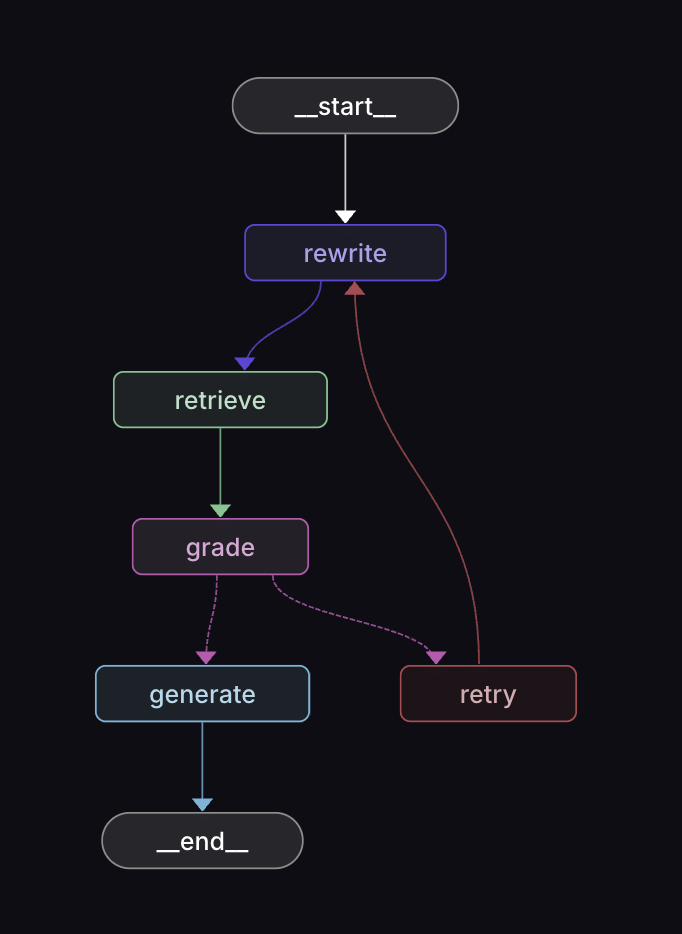

# Agentic RAG

Self-corrective Agentic RAG system built with LangGraph, LangChain, ChromaDB, Gemini embeddings, and Groq LLMs.

## Features

- Self-corrective RAG workflow
- Query rewriting for better retrieval
- Retrieval relevance grading
- Automatic retry mechanism
- PDF ingestion pipeline
- ChromaDB vector storage
- LangGraph state orchestration
- LLM-powered answer generation

## Architecture

This creates a self-corrective retrieval loop instead of a traditional single-pass RAG pipeline.

## Environment Variables

Create a .env file:

GROQ_API_KEY=your_key
GOOGLE_API_KEY=your_key

LANGSMITH_API_KEY=your_key
LANGSMITH_TRACING=true
LANGSMITH_PROJECT=langgraph-js

## Running ChromaDB

docker run -p 8000:8000 chromadb/chroma

## Run Project

yarn install
yarn run dev

## Run LangGraph Studio:

yarn run graph
